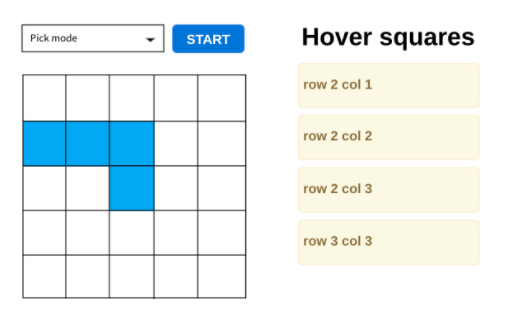

# Squers App

This app bootstrapped with [Create React App](https://github.com/facebook/create-react-app).

## To successful passing of our test you should handle with following criterions:
  * the app MUST work without errors
  presets for app mode you can fetch using this endpoint http://demo1030918.mockable.io/ or https://demo1030918.mockable.io/. 
  * This is should be request to the server NOT just copy paste of data
    * This data is array of objects with field:
      * field - contain size of app field. Should be square form

## Work description:
  * user set app mode
  * press START
  * if the user hovers on the square - he turns blue
  * if the user hovers on the blue square - he turns white
  * show hover squares

## Example of design:

## In the project directory, you can run:

### `npm install`

This command installs all packages that app depends on.

### `npm start`

Runs the app in the development mode.\
Open [http://localhost:3000](http://localhost:3000) to view it in the browser.

### `Ctrl+C in terminal`

Used to stop a running application 
